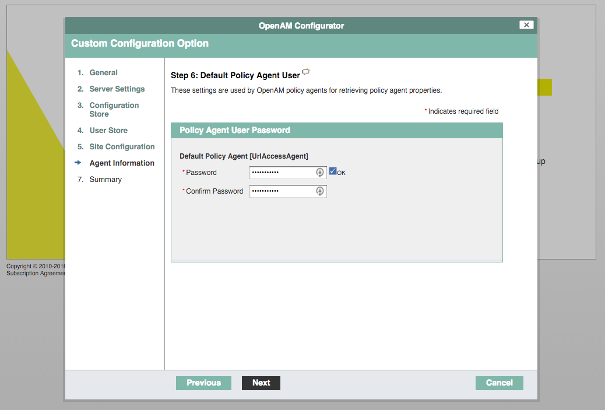
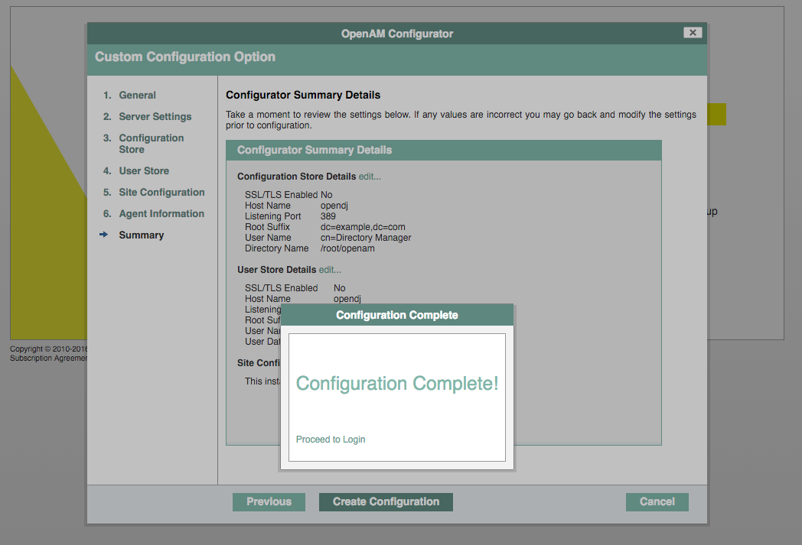

# OPENAM

## DOCUMENTATION

* http://openidm.forgerock.org/doc/bootstrap/install-guide/index.html#full-stack-sample
* https://wikis.forgerock.org/confluence/display/openam/Deploy+OpenAM
* https://github.com/ForgeRock/docker

## INSTALLATION

### opendj

#### Configuration
The settings like Root Suffix "dc=example,dc=com" come from the [Dockerfile](https://github.com/ForgeRock/docker/blob/master/opendj-nightly/Dockerfile) and can be overridden with a new Dockerfile accordingly. 

#### Ports
| Port | Function  |
| ---- |-----|
| 389  | ldap  |
| 636  | sldap|
| 4444 | task is scheduled through communication over SSL on the administration port, by default 4444|

### openam

#### Ports
| Port | Function  |
| ---- |-----|
| 8080  | ldap  |
| 8081  | sldap|
| 8082 | task is scheduled through communication over SSL on the administration port, by default 4444|

### openidm

TBD with postgress see [https://hub.docker.com/r/wstrange/openidm-postgres/](https://hub.docker.com/r/wstrange/openidm-postgres/)

[openam interface](http://host:8090/openam)


Start opendj and openam with 
```
$ docker-compose up -d
```

| Screenshots of installation |
| ---- |
||
|Fig 1: Goto [openam interface](http://host:8090/openam) and select 'Custom Configuration'|
|| 
|Fig 2: make a new password for user 'amadmin'|
||
|Fig 3: We're not doing SSO right now so leave these settings for now and click 'Next'|
||
|Fig 4: connect opendj port 386, use 'password' as password, Root Suffix is 'dc=example,dc=com' and click 'Next'|
||
|Fig 5: use the same values as in Fig 4 and click 'Next' |
||
|Fig 6: Leave these empty and click 'Next'|
||
|Fig 7: Generate a nice password and click 'Next'|
||
|Fig 8: Validate the settings and click 'Next'|
||
|Fig 9: Settings are successfully applied|
||
|Fig 10: Login with user 'amadmin' with password from Fig 2|
||
|Fig 11: And openam is successfully installed| 

## RUNNING
